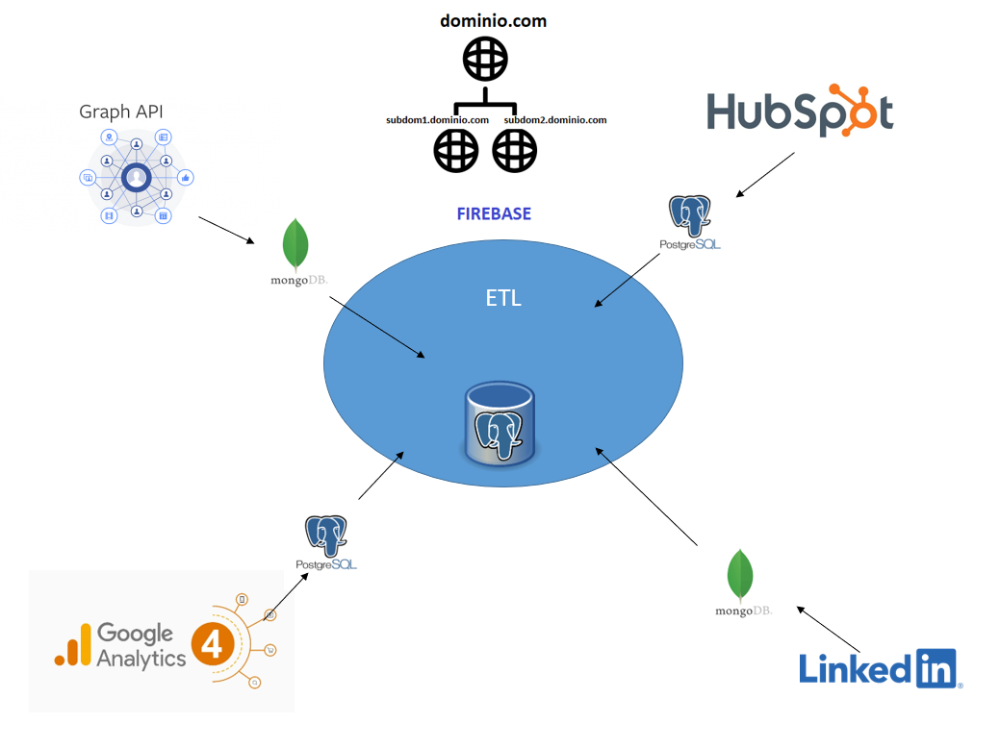

<h1 align="center"> HubMetaDatosRedesSociales </h1> 

Aplicacion compuesta por un conjunto de lambdas que recuperan datos de Meta, Hubspot, Google Analytical y Linkedln. Asi como un aplicacion movil que ejecute este 
ultimo para obener los datos devueltos de cada lambda y almacenarlo en una base de datos.

 

<figure>
  
  <figcaption>Figura 1 - Arquitectura</figcaption>
</figure>

<h2> Tecnlologias de la Información </h2>

<ul> 
  
  <li> PostgreSQL </li>
  <li> Java </li>
  <li> Libreria RestFB  </li>
  <li> FrameWork Spring  </li>
  <li> Cloud AWS </li>
    

</ul>

<h2>Requerimientos Aplicacion en Facebook</h2> 

<dl>
  <dt>Access Tokens</dt>
  <dd>Token de acceso de la Aplicación</dd>
  <dt>Permisos</dt>
  <dd> read_insights, pages_read_engagement</dd>
  <dt>Permisos</dt>
  <dd> read_insights, pages_read_engagement</dd>
  <dt>Tareas de página</dt>
  <dd>ANALYZE</dd>
</dl>

<h2 > Backups </h2> 

[Backup semilla](script) para llenar la base de datos con el conjunto inicial de datos para la configuracion del Graph API version 16.0

<h2 > Lambda Meta </h2> 

Lambda en AWS que recibe un archivo de configuración de Fan Pages definidas por la empresa y de las cuales se consulta las estaditicas de cada una y 
las devuelve en un JSON.

<h2>Documentacion </h2> 

La documentacion del proyecto la puede encontrar [aqui](doc)

